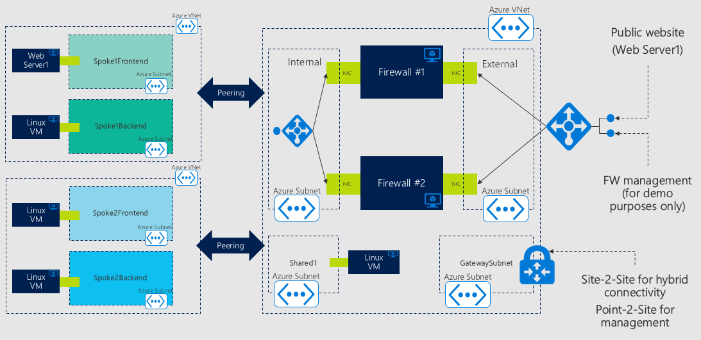

# halab - Readme

This repository contains ARM (Azure Resource Manager) templates to deploy lab environaments for highly avaialble (HA) firewall clusters.
Two templates (and their companion parameter files) are provided.

1. [ha_lab_hubspoke_IPTables.json](ha_lab_hubspoke_IPTables.json): This template creates a HA firewall cluster based on Linux boxes that run IPTables. Any Linux distribution for which images are available in Azure can be used.

2. [ha_lab_hubspoke_Fortinet.json](ha_lab_hubspoke_Fortinet.json): This template creates a HA cluster based on Fortigate Next-Generation Firewalls. The same template can be used to deploy firewall clusters based on images made available in the Azure marketplace by other vendors.

The firewall cluster is active/active. Azure load balancers ([Standard SKU](https://docs.microsoft.com/en-us/azure/load-balancer/load-balancer-standard-overview)) are used to distribute incoming connections across all the available instances. The template supports both resiliency models currently available in the Azure platform: Availability Sets (GA feature) and Availability Zones (currently in Public Preview).

The templates create a hub&spoke network topology. The firewall cluster is deployed in the hub VNet and secures the following connections:

- Connections to the public internet initiated by VM's in the hub or in the spokes;
- Connection from the public internet to internal VM's (only for selected endpoints published through the firewall cluster);
- Connections between VM's in different subnets of the spoke VNet;
- Connections between VM's in different spoke VNets.

The template can (optionally) deploy a Virtual Network Gateway in the hub VNet, and configure it for Point-To-Site connectivity. This can be useful for management purposes. By default, the external network interface of each firewall cluster instance is also exposed to the public internet (only ports 22/TCP and 443/TCP). This is recommended for testing/demo environments only.

The enviroment deployed by the template is show in the following picture.

